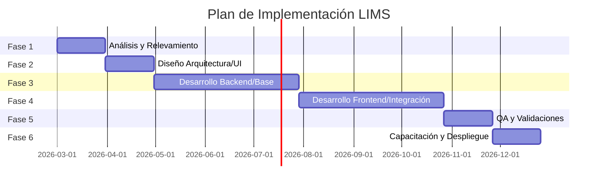

# Itinerario de Producción - Sistema LIMS URUFARMA

Este documento detalla el plan de acción para el desarrollo e implementación del Sistema de Gestión de Información de Laboratorio (LIMS) en URUFARMA S.A. El objetivo es transitar de un modelo analógico basado en papel a una arquitectura digital centralizada y automatizada.

## 1. Metodología de Trabajo

Se adoptará una metodología **Ágil (Scrum/Kanban)** para permitir entregas incrementales y ajustes continuos basados en el feedback de los usuarios clave.

*   **Sprints:** De 2 a 3 semanas.
*   **Revisiones:** Al finalizar cada sprint con los interesados (stakeholders).
*   **Validaciones:** Pruebas de usuario (UAT) constantes para asegurar la usabilidad.

---

## 2. Fases del Proyecto

### Fase 1: Análisis y Definición de Requerimientos (Mes 1)
*   **Relevamiento Detallado:** Entrevistas con operadores, supervisores y analistas para mapear flujos actuales.
*   **Refinamiento de Especificaciones:** Finalización del PRD y definición de KPIs.
*   **Diseño de Datos:** Consolidación del Modelo Entidad-Relación (MER) basado en el esquema `MER.mmd`.

### Fase 2: Diseño de Arquitectura y UX/UI (Mes 2)
*   **Infraestructura Backend:** Configuración de FastAPI, SQLAlchemy y Alembic.
*   **Diseño de Interfaz:** Creación de mockups en Figma/Adobe XD para interfaces intuitivas (registro de datos, dashboards).
*   **Definición de Seguridad:** Implementación de roles (RBAC) y protocolos de auditoría (Audit Trail).

### Fase 3: Desarrollo del Núcleo (Backend & Database) (Mes 3-5)
*   **Módulo 1 (Sistemas y Recursos):** Gestión de Plantas, Áreas y Equipos.
*   **Módulo 2 (Usuarios y Seguridad):** Autenticación, Roles y Trail de Auditoría.
*   **Módulo 3 (Configuración Técnica):** Productos, Especificaciones y Métodos de Análisis.
*   **Módulo 4 (Operaciones y Manufactura):** Órdenes de Manufactura y Muestreo.

### Fase 4: Desarrollo del Frontend e Integración (Mes 6-8)
*   **Componentes React:** Desarrollo de formularios dinámicos y paneles de control.
*   **Gestión de Estados:** Sincronización en tiempo real entre el Frontend y Backend.
*   **Módulo de Análisis y Resultados:** Recepción de muestras, incubación y reporte de resultados con validación automática de límites.
*   **Módulo de Materiales:** Gestión de stock de medios de cultivo y reactivos.

### Fase 5: Pruebas y Aseguramiento de Calidad (Mes 9)
*   **Carga de Datos:** Pruebas de rendimiento con grandes volúmenes de información.
*   **Validaciones de Integridad:** Verificación de que el `Audit Trail` capture todos los cambios.
*   **Pruebas QA:** Identificación y corrección de bugs críticos.

### Fase 6: Implementación y Puesta en Marcha (Mes 10)
*   **Capacitación:** Talleres para operadores y supervisores.
*   **Migración de Datos:** Carga de datos maestros (Equipos, Productos, Usuarios).
*   **Despliegue Productivo:** Paso de SQLite a PostgreSQL y configuración de servidores de alta disponibilidad.

---

## 3. Entregables Clave por Módulo

| Módulo | Entregable Principal | Documento de Referencia |
| :--- | :--- | :--- |
| **Recursos** | Panel de gestión de Equipos y Calibraciones | MER (EQUIPO, AREA, PLANTA) |
| **Seguridad** | Registro de Auditoría (Audit Trail) funcional | PRD (Sección 6.5) |
| **Análisis** | Formularios de ingreso de resultados con validación | MER (ANALISIS, RESULTADO) |
| **Materiales** | Inventario de Medios y Reactivos | MER (STOCK_MEDIOS, POLVO) |
| **Reporting** | Dashboards en Power BI / Tabla de Reportes | Requisitos Técnicos (Sección 11) |

---

## 4. Riesgos Críticos y Mitigación

1.  **Resistencia al Cambio:** Mitigar mediante la inclusión de usuarios finales en las etapas de diseño.
2.  **Integridad de Datos en Migración:** Realizar pruebas de carga exhaustivas antes de la puesta en producción.
3.  **Complejidad del Modelo Normativo:** Asegurar que cada campo cumpla con los requisitos de trazabilidad (GAMP 5 / 21 CFR Part 11).

---

## 5. Cronograma Resumido (Gantt Conceptual)

---
**Elaborado el:** 18 de Febrero de 2026
**Ubicación:** `documentacion/itinerario_produccion.md`
